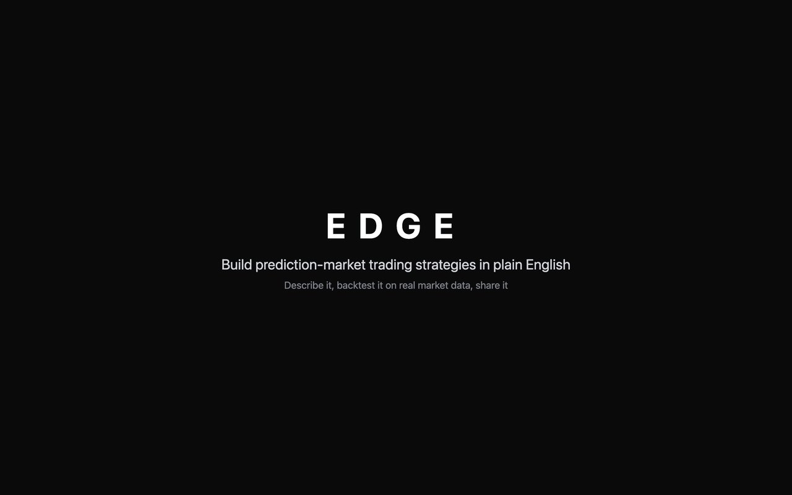
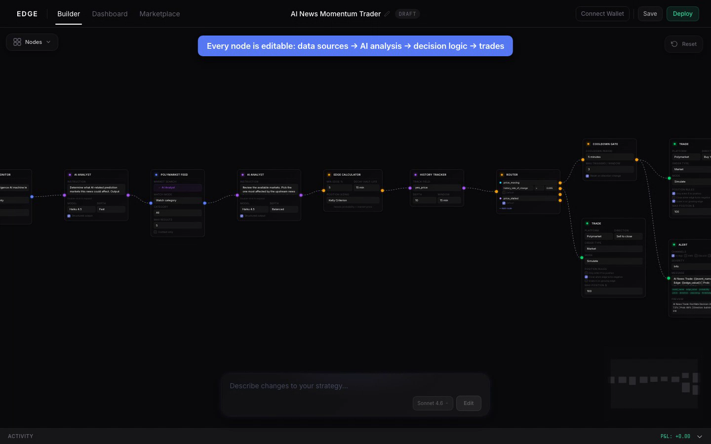
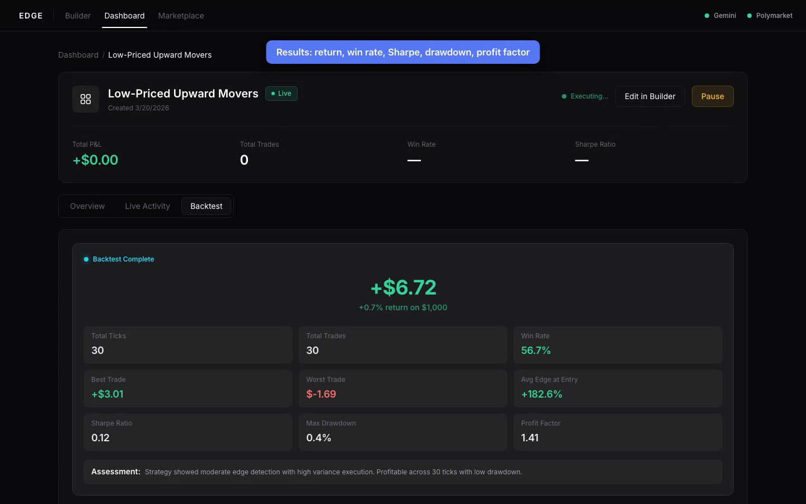
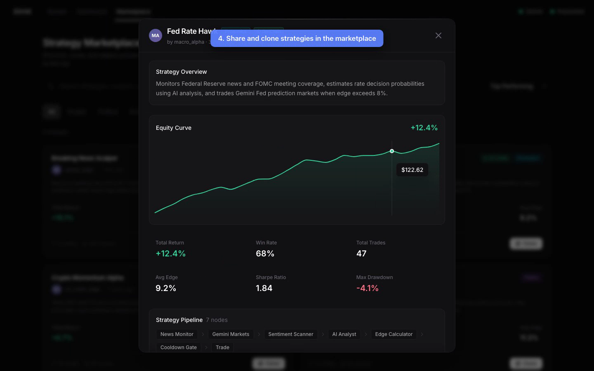

# Edge

**Build prediction-market trading strategies in plain English, backtest them on real market data, and share them.**

Edge is a no-code strategy builder for prediction markets like Polymarket and Gemini. You describe a trading idea in a sentence. Edge turns it into an editable visual workflow, replays it against real historical prices, and shows how it would have performed.

[](docs/demo.mp4)

▶ **[Watch the full demo (66s, MP4)](docs/demo.mp4)**

*Solo hackathon project, built over one weekend in March 2026.*

---

## The problem

Prediction markets move on news: a headline breaks, the odds shift, and the traders who react first capture the edge. Today, acting on that systematically means writing code to pull news, find the right market, estimate a fair probability, and place the trade. That limits automated strategies to people who can program.

**Who it's for:** traders who already have a thesis ("when Fed news breaks, rate markets lag by a few minutes") but can't or don't want to build a trading bot.

## What Edge does

| Step | What the user does | What Edge does |
|---|---|---|
| **1. Describe** | Types a strategy in plain English | An LLM turns it into a visual node graph: data sources → AI analysis → decision logic → trades |
| **2. Edit** | Tweaks nodes on a drag-and-drop canvas, or asks the AI for changes | Validates the graph so every strategy is runnable |
| **3. Backtest** | Clicks *Run Backtest* | Replays the strategy tick by tick on real Polymarket and Gemini prices, narrating each decision, and reports return, win rate, Sharpe ratio, and drawdown |
| **4. Share** | Publishes to the marketplace | Others can browse strategies ranked by performance and clone them. Strategies can be encrypted and minted as NFTs so the author keeps ownership of the logic |

| Visual builder | Backtest results | Marketplace |
|---|---|---|
|  |  |  |

## Product decisions

- **Plain English first, canvas second.** A blank canvas is intimidating, so the default entry point is a text box. The visual graph is there to build trust: users can see and adjust exactly what the AI built instead of trusting a black box.
- **Show the reasoning, not just the result.** The backtest narrates every tick ("News: … | Sentiment: −33 | AI: 50% | Edge: +0.8%") and highlights each node as it runs. Users can see *why* a trade happened, which is what makes a strategy worth iterating on.
- **Narrowed scope mid-hackathon.** The first version was a market dashboard plus a separate blockchain feature. I cut it down to one product (builder → backtest → marketplace) and prioritized in that order, because a cohesive flow demos better than three half-finished features.
- **Paper trading only.** Every trade is simulated. Real-money execution adds legal and risk questions a hackathon prototype shouldn't take on. The value to prove first was whether people can express and test strategies at all.
- **Small, single-purpose building blocks.** The 20+ node types each do one job (watch news, estimate a probability, size a position, rate-limit trades). That keeps AI-generated graphs reliable and lets users swap one piece without breaking the rest.

## How it's built

| Layer | Tools |
|---|---|
| App | Next.js 14, React 18, TypeScript, Tailwind CSS |
| Visual editor | React Flow, dagre (auto-layout) |
| AI | Anthropic Claude API (strategy generation, probability estimates) |
| Market data | Polymarket CLOB API, Gemini Prediction Markets API, NewsAPI and RSS |
| Backtesting | Custom tick-by-tick engine, Recharts |
| Storage | SQLite |
| Ownership | Client-side AES-256-GCM encryption, 0G decentralized storage, Solana NFTs (Metaplex) |

The engine runs each strategy as a directed graph: data-source nodes produce events, and each event flows through analysis, decision, and action nodes in order. For node specs, the edge and confidence math, and data-source details, see the **[technical deep dive](docs/TECHNICAL.md)**.

## Run it locally

```bash
git clone https://github.com/loganstaples/Edge.git
cd Edge/oracle
npm install
cp .env.example .env.local   # then add your API keys
npm run dev                  # http://localhost:3000
```

Only `ANTHROPIC_API_KEY` is needed for AI strategy generation. Market data comes from public Polymarket and Gemini endpoints. See [`oracle/.env.example`](oracle/.env.example) for the optional keys (news, SMS alerts, decentralized storage).

## Limitations and what I'd do next

- **Simulated trades only.** The next step would be exchange order execution with position limits and kill switches.
- **Short backtest window.** Public price APIs give about 7 days of hourly data. Longer, stored history would make results more meaningful.
- **Seeded marketplace.** Marketplace listings are sample data. Live rankings would need real user-submitted strategies and protection against overfit, cherry-picked backtests.
- **Some sources are proxied.** Twitter/X data is simulated, and on-chain "whale" activity is estimated from exchange trades.
- **Validate demand first.** Before building more, I'd interview active prediction-market traders to learn whether the bottleneck is building strategies, trusting them, or finding edge at all.

## Author

**Logan Staples**, sole designer and developer
